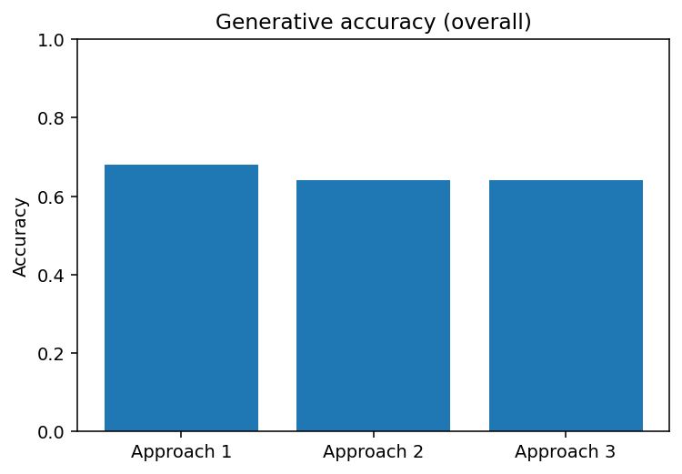

# Iranian celebrities multimodal RAG

A research-grade Retrieval-Augmented Generation (RAG) system for answering questions about notable figures in Iran’s history and culture. The project supports **unimodal (text-only)** and **multimodal (text+image)** pipelines, with evaluation on both **multiple-choice (MCQ)** and **open-ended (without options)** question sets.

> **Scope & categories:** Athlete · Politicians · Poets · Art\_music · Scientists

---

## Why this project?

* **End-to-end RAG**: from noisy source files to normalized JSON, image assets, and evaluable question sets.
* **Multimodal grounding**: uses local images plus robust fallbacks (e.g., Wikimedia) to anchor generations.
* **Reproducible evaluation**: clean test splits for MCQ and without-options formats, unimodal and multimodal.

---

## Datasets & Files

### Core entity store

* **`normalized_data_final.json`** — the consolidated catalog of celebrities, including:

  * `name` (may come from heterogeneous sources)
  * `category` (one of the five above)
  * `summary`, `summary2`, `summary3` (clean biographical snippets)
  * `image` (normalized structure; may include crawled URLs and local image references)


#### Stats

| category    | records | summary\_present | summary\_present\_% | char\_len\_mean | char\_len\_median | char\_len\_p25 | char\_len\_p75 | word\_count\_mean | word\_count\_median |
| ----------- | ------- | ---------------- | ------------------- | --------------- | ----------------- | -------------- | -------------- | ----------------- | ------------------- |
| art\_music  | 468.0   | 468.0            | 100.0               | 310.78          | 266.5             | 174.75         | 374.0          | 66.23             | 55.5                |
| athlete     | 2329.0  | 2329.0           | 100.0               | 181.83          | 150.0             | 94.00          | 230.0          | 34.44             | 29.0                |
| poets       | 203.0   | 203.0            | 100.0               | 299.46          | 297.0             | 161.50         | 396.0          | 62.01             | 61.0                |
| politicians | 981.0   | 981.0            | 100.0               | 308.49          | 301.0             | 229.00         | 373.0          | 63.53             | 62.0                |
| scientists  | 111.0   | 111.0            | 100.0               | 319.59          | 338.0             | 180.00         | 425.5          | 64.98             | 70.0                |


> Many original records contained irregular structures. Name normalization, summary cleaning, and image field consolidation were applied (see “Data preparation pipeline” below).

### Question sets (evaluation)

* **Unimodal (text-only)**

  * `mcq_questions_90.json` — 90 MCQ questions
  * `uni_questions_110.json` — 110 open-ended questions
* **Multimodal (text+image)**

  * `mcq_with_image_50_final.json` — 50 MCQ questions with images
  * `multi_with_image_50_newV.json` — 50 open-ended questions with images

> The **number** in each filename is the **count of test questions**.

### Preprocessing reports

* `image_match_report.csv`
* `image_match_stats_by_category.csv`
* `summary_stats_by_category.csv`

(There is also a stats image you can embed here once paths are finalized.)

---

## What’s inside (at a glance)

The repository is organized around three pipelines:

1. **Unimodal** (text-only) — MCQ + without-options
2. **Multimodal** (text+image) — MCQ
3. **Multimodal** (text+image) — without-options

You can jump directly to any pipeline from the table of contents, after setting up the data assets.

---

## Data preparation pipeline (before any RAG)

This project began with a series of notebooks/scripts that standardize and enrich the data:

* **Category JSON merge & image-field union**
  Deduplicate people across same-category files; merge `image` fields (supports dict/list/str); preserve provenance; produce “\_merged.json”.

* **Attach narratives → `summary`/`summary2`/`summary3`**
  Parse biography CSVs, align by normalized names, and fill summary slots (up to 3 per person). Produce “\_with\_bios.json”.

* **Image harvesting (download & crawl)**
  Attempt direct downloads from provided fields; when missing or failing, **crawl candidates** using:

  * Optional **Google** (SerpAPI or CSE) if keys are available
  * **Wikimedia/Wikipedia** fallback (no keys required)
    Convert SVGs to PNG thumbnails where necessary. Mark `is_image_downloaded` flags.

* **Image cleanup & renaming**
  Deduplicate and rename images to a consistent scheme:
  `rep_index_human-name.ext` (rep = 0,1,2…), preserving stable alignment between files and records.

* **Politicians summary augmentation**
  Extract best (longest/cleanest) summary per person from `politicians_image_text_pairs.csv` and inject into the politicians JSON.

* **All-category merge**
  Concatenate category outputs into a single file (e.g., `all_fields_merged.json`) with `category` and `field_idx` annotations.

* **Persian text normalization**
  Normalize `summary*` fields using **Hazm** and **DadmaTools** (character unification, punctuation spacing, HTML stripping, etc.).
  Final output is saved as **`normalized_data_final.json`** (used by the RAG pipelines).

> The notebooks include detailed console reports (added/updated summaries, image success rates, per-category counts).

---

## Dependencies

Minimum suggested stack (install only what you use in your runs):

```bash
python >= 3.9
pip install pillow hazm dadmatools tqdm pandas numpy
# Optional for crawling (only if you enable Google providers):
# export SERPAPI_API_KEY=...     # for SerpAPI image search
# export GOOGLE_API_KEY=...      # for Google CSE image search
# export GOOGLE_CSE_ID=...       # for Google CSE image search
```

> The RAG components themselves may additionally use common libraries such as `sentence-transformers`, `faiss-cpu` (or another vector index), and an LLM runtime. Install those according to your chosen backend.

---

## Repository layout

```
MASHAHAHIR_RAG_2/
├─ apps/
│  ├─ multimodal_open.py                          # a minimal Gradio demo (text+image -> RAG)
│  └─ unimodal_app.py                             
├─ artifacts/
│  ├─ final_baseline/
│  │  ├─ evaluation/                              # baseline eval outputs (tables/figures)
│  │  ├─ notebooks/                               # baseline analysis notebooks
│  │  └─ runs/                                    # baseline run artifacts/logs
│  ├─ multimodal/                                 # general multimodal artifacts (shared)
│  ├─ Multimodal_NoOptions/                       # multimodal (open-ended / no-options) pipeline
│  │  ├─ indexes/
│  │  │  ├─ vector_image.index                    # FAISS index (image/text CLIP embeddings)
│  │  │  └─ vector_image_metadata.csv             # rows: image_path, name, description, ...
│  │  └─ fine_tuned_clip/                         # saved CLIP weights + tokenizer + processor
│  ├─ notebooks/                                  # scratch notebooks for experiments
│  ├─ reports/                                    # aggregated reports across runs
│  ├─ runs/                                       # experiment run dirs (checkpoints, logs)
│  └─ unimodal/                                   # unimodal (text-only) pipeline artifacts
│     ├─ embeddings/                              # raw/npz embeddings
│     ├─ indexes/                                 # FAISS indexes for unimodal
│     ├─ m-e5-base/                               # cached multilingual-e5 model snapshot
│     ├─ reports/
│     └─ runs/                                    # per-run outputs/logs for unimodal
├─ baseline/                                      # baseline configs/scripts
├─ data/
│  ├─ processed/                                  # cleaned datasets ready for RAG
│  └─ raw/                                        # raw source data (as crawled)
└─ questions/                                     # evaluation questions (MCQ / open-ended JSONs)
```

---

## Reproducibility tips

* Keep environment variables outside the repo (e.g., via a `.env` you don’t commit).
* If you don’t have Google API keys, Wikimedia/Wikipedia fallback still works (slower but key-free).
* Ensure Unicode-safe handling: filenames use a sanitized **human name**; JSON uses NFC normalization.
* For deterministic experiments, fix seeds for embedding, sampling, and LLM decoding (where applicable).

---

## Ethics & use

This dataset includes real people. Please use it responsibly:

* Avoid generating defamatory or sensitive claims.
* Cite sources where feasible; images may carry licenses (Wikimedia Commons, etc.).
* Respect cultural naming conventions and transliteration ambiguity.

---

## Baseline (No-RAG, zero-shot GPT-4o / GPT-4o-mini)

This baseline **does not use our retrieval or indices**. It answers the same test sets with a zero-shot LLM (Persian prompts), so it reflects a *model-only* prior.

**Covers**

* **Text MCQ (90)** → `Questions/mcq_questions_90.json`
* **Multimodal MCQ (50)** → `Questions/mcq_with_image_50_final.json` (image passed when supported)
* **Multimodal Open-ended (50)** → `Questions/multi_with_image_50_newV.json` (LLM-as-judge)
* **Unimodal Open-ended (110)** → `Questions/uni_questions_110.json` (LLM-as-judge)

**Key ideas**

* Persian **normalization** (Arabic→Persian chars, digit unification, ZWNJ/controls stripped).
* MCQ answers are **forced to be one of the given options** (normalized match).
* Optional **self-consistency** for MCQ (vote over multiple samples).
* Open-ended sets use **LLM-as-judge** returning a single token: **«بله/خیر»**.
* If image input isn’t supported by the endpoint, the code **falls back to text-only**.

**How to run**

1. Open the notebook **`Final_RAG_API_Baseline.ipynb`**.
2. Set credentials **via environment variables** (don’t hard-code keys):

   ```bash
   export API_KEY=...          # your key
   export BASE_URL=https://api.gapgpt.app/v1   # or your provider
   ```
3. Ensure the question JSONs exist under `Questions/` as listed above.
4. (Optional) Toggle flags in the notebook:

   * `USE_SELF_CONSISTENCY` (default `False`), `SC_SAMPLES`, `SC_TEMPERATURE`
   * `SUPPORTS_IMAGE_MESSAGES` (`True` if your endpoint accepts image content)

**Outputs (written to `rag_out/baseline/`)**

* `baseline_text_MCQ_outputs.csv`
* `baseline_multimodal_MCQ_outputs.csv`
* `baseline_multimodal_NO_OPTIONS_outputs.csv`
* `baseline_unimodal_NO_OPTIONS_outputs_4o.csv` and/or `_4o_mini.csv`

Each CSV includes `is_correct` (0/1) and adds `category` by joining to the question files.

**Baseline evaluation (auto-generated) → `rag_out/baseline/evaluation/`**

* Tables:

  * `overall_summary.csv` (accuracy per set)
  * `by_category_<set>.csv`, `per_question_<set>.csv`, `hardest_<set>.csv`
  * `agg_by_category_all_sets.csv`
* Figures:

  * `accuracy_by_set.png`
  * `accuracy_by_category_<set>.png`, `count_by_category_<set>.png`
  * `accuracy_by_category_all_sets.png`
  * `per_question_correctness_map.png`
  * `accuracy_heatmap_category_model.png`
  * `category_accuracy_radar.png`
  * `rationale_length_boxplots.png` (for MCQ sets)

**Scoring**

* **MCQ**: exact (normalized) match of `predicted_option` vs `answer`.
* **Open-ended**: judge model returns «بله/خیر» for semantic equivalence; accuracy is mean of `is_correct`.

<div align="center">

<br>
<sub><em>Baseline accuracy on each question set by category</em></sub>

</div>

<div align="center">

<br>
<sub><em>Baseline accuracy by category radar</em></sub>

</div>

---

# Unimodal pipeline (text-only): MCQ & without-options

This section documents the **text-only** RAG pipeline that powers both multiple-choice (MCQ) and free-form (without-options) question sets. It is implemented in the notebook:

* `Embedding_and_unimodal_pipeline (1).ipynb`

The two question sets are:

* **MCQ**: `mcq_questions_90.json`

  ```json
  {
    "question": "…؟",
    "options": ["…","…","…","…"],
    "answer": "…",
    "category": "athlete|art_music|poets|politicians|scientists"
  }
  ```
* **Without-options**: `uni_questions_110.json`

  ```json
  {
    "question": "…؟",
    "answer": "…",
    "category": "athlete|art_music|poets|politicians|scientists"
  }
  ```

---

## Pipeline overview

1. **Catalog → docs**

   * Load `normalized_data_final.json` (each record has at least `name`, `summary`, optionally more fields).
   * Persist as **JSONL** (`docs.jsonl`) — one record per line to keep a stable row id.

2. **Embedding (text)**

   * Model: `intfloat/multilingual-e5-base`.
   * For each doc, build a compact passage string:
     `passage: {name} | {summary}`
   * Encode with **normalized, unit-length** embeddings (cosine via dot product).

3. **Indexing (text)**

   * Primary: **FAISS** (IndexFlatIP).
   * Fallback: **hnswlib** (cosine).
   * Save artifacts:

     * `faiss_text.idx` – vector index
     * `text_embeds.npy` – matrix of embeddings (float32, L2-normed)
     * `text_ids.npy` – row→doc mapping (int32)

4. **Query normalization** (important for Persian):

   * Arabic → Persian chars (`ي/ك/ة/…` → `ی/ک/ه/…`)
   * Eastern digits → ASCII (`۰۱۲…` → `012…`)
   * Unicode `NFKC`, whitespace squeeze, casefold
   * Encode the query as: `query: {normalized_query}`

5. **Retrieval**

   * KNN over the text index (default `k=5`).
   * Hits carry: `_row` (doc id), `_score` (cosine/IP), plus original fields.

6. **Task layers**

   * **MCQ retrieval evaluation** (entity & answer Hit\@K)
   * **MCQ generation**: use top-K contexts to answer and justify **one option**.
   * **Without-options (OpenQA)**: use top-K contexts to produce a short free-form answer.
   * **LLM-as-judge** (for OpenQA): binary semantic match of model answer vs. gold.

---

## How MCQ is evaluated (text-only)

* **Entity Hit\@K**: does any retrieved doc among top-K match the *target entity*?
  Targets are inferred by:

  1. exact match of **answer** (if the gold is a name present in the catalog), else
  2. fallback entity mention **detected in the question** (longest normalized match).
* **Answer Hit\@K**: does the **gold answer string** appear in the top-K retrieved name/summary texts?

Runtime artifacts written during evaluation:

* `eval_mcq_report.json` – compact Hit\@K summary
* `eval_mcq_details.jsonl` – per-question retrieval details
* `retrieval_samples.jsonl` – printed “hit” examples
* `retrieval_misses.jsonl` – printed “miss” examples
* `search_logs.jsonl` – raw ad-hoc search traces used for diagnostics
* `text_mcq_top3_results.csv` – top-3 option re-ranking (rank-weighted presences)

---

## How MCQ is *answered* (generative)

* Retrieve top-K (K≤3) contexts from the text index.
* Prompt (Persian) constrains the model to:

  * pick **exactly one** `predicted_option` (or leave empty if unsupported),
  * optionally expose `target_name`,
  * return an **evidence\_span** that is a direct quote from one of the contexts.
* Outputs are saved to:

  * `Text_set_generative_outputs.csv` (subset runs)
  * `generative_metrics_summary.json` (aggregated metrics; see table below)

---

## How without-options is evaluated (OpenQA)

* Retrieve **top-3** contexts per question and cache them in `openqa_cached_top3.json`.
* Generate `answer_text` with a strict “**answer only from context or say I don’t know**” rule.
* Score with an **LLM-as-judge** that returns `1` if the generated answer is semantically equivalent to gold, else `0`.
* Artifacts:

  * `openqa_outputs.csv` – generation outputs
  * `openqa_with_judge.csv` – with the judge’s `0/1`
  * `openqa_details.jsonl` – optional richer traces (when enabled)

**Result (without-options):** Overall accuracy **0.773**

---

## Key metrics (MCQ generative)

The following table is directly transcribed from `generative_metrics_summary.json`:

| Metric                                  |     Value |
| --------------------------------------- | --------: |
| Rows (questions)                        |        90 |
| **Top-1 accuracy**                      | **0.878** |
| Coverage (non-empty prediction rate)    |     0.922 |
| In-options rate (pred ∈ options)        |     0.889 |
| Evidence text present                   |     1.000 |
| Evidence located (which ctx)            |     0.567 |
| Accuracy · **supported** (has evidence) | **0.961** |
| Accuracy · unsupported                  |     0.769 |
| Pred ↔ evidence consistency             |     0.747 |
| Gold ↔ evidence consistency             |     0.667 |
| Retrieval ceiling (gold name in ctx)    |     0.156 |

**Takeaways**

* When the model’s choice is **supported by an explicit evidence span**, accuracy is **\~96%**.
* Retrieval ceiling is intentionally low (0.156): many MCQs don’t directly state the correct option in the **retrieved top-K**, so the prompt’s “evidence or abstain” constraint is meaningful.

---

## Visual summaries

You can embed these images directly in the README:

* **MCQ (OpenQA judge) dashboards**

  * 
  * 
  * 
  * 
  * 
  * 

---

## What each artifact is (quick map)

**Results (unimodal)**

* `Text_set_generative_outputs.csv` — MCQ generation (subset run; `target_name`, `predicted_option`, `evidence_span`).
* `eval_mcq_details.jsonl` — per-MCQ retrieval diagnostics: target indices, ranks, booleans for Hit\@K.
* `eval_mcq_report.json` — compact Hit\@K report (entity & answer).
* `openqa_details.jsonl` — optional appended traces for without-options runs.
* `openqa_outputs.csv` — without-options generations (`answer_text`), one row per question.
* `openqa_with_judge.csv` — same as above + `judge_match` (`0/1` semantic match).
* `retrieval_misses.jsonl` — examples where entity wasn’t in top-K.
* `retrieval_samples.jsonl` — examples where entity was found (with ranks).
* `search_logs.jsonl` — raw search trace (query, top-k names/scores).
* `text_mcq_top3_results.csv` — MCQ option re-ranking from retrieved docs (rank-weighted presence scores, top-3 options, predicted answer).

**Embeddings & index**

* `text_embeds.npy` — N×D float32 matrix of doc embeddings (E5-base, normalized).
* `faiss_text.idx` — FAISS IP index (cosine).
* `text_ids.npy` — array of row ids aligned with `docs.jsonl`.

**Evaluation (plots and summary)**

* `overall_accuracy.png` — OpenQA judge accuracy (global).
* `accuracy_by_category.png` — accuracy per category.
* `count_by_category.png` — number of questions per category.
* `length_difference_distribution.png` — |pred len − gold len| histogram.
* `accuracy_vs_gold_length.png` — accuracy by gold answer length bucket.
* `heatmap_category_vs_length.png` — category × length-bucket heatmap.
* `generative_metrics_summary.json` — the aggregated MCQ metrics used in the table above.

---

## Repro/notes (important implementation details)

* **Prefixing matters**: All document texts are embedded as `passage: …`, and queries as `query: …` to match e5 training.
* **Cosine via inner product**: vectors are L2-normalized at encode time; FAISS `IndexFlatIP` ≡ cosine.
* **Persian-aware normalization**:

  * Arabic→Persian letters (`ي/ك/ة/ۀ/…`)
  * Eastern digits→ASCII
  * Unicode NFKC, casefold, whitespace squeeze
    This **same normalization** is used to:
  * build entity name keys,
  * check string containments for Answer Hit\@K,
  * align model predictions with options (normalized equality).
* **Entity targeting**: longest normalized name match inside the question if the gold answer isn’t a catalog name.
* **Rank-weighted option scoring (MCQ retrieval CSV)**: options are scored by presence in top-M docs with weights `1/rank`.

---

# Multimodal MCQ Pipeline (RAG + Vision)

This section documents the **end-to-end Multimodal MCQ pipeline** that powers retrieval-augmented, image-conditioned multiple-choice answering over a Persian knowledge base. It is based on the main notebook you shared (`Multimodal_MCQ_RAG.ipynb`). The pipeline has three phases:

1. **Data & images preprocessing** → 2) **Multimodal indexing** (E5 text + CLIP image) → 3) **MCQ inference** (retrieval of top-3 options, then three alternative generative/verification approaches).
   An **evaluation suite** (Hit\@K, MRR, accuracy, per-category breakdown) closes the loop.

---

## What the pipeline delivers

* **Top-3 retrieval per MCQ** with a fused text→doc and text→image search.
* **Three answerers**:

  * **A1. Vision API pairwise verification** (query image vs each of the top-3 identities) + text-conditioned reasoning.
  * **A2. Vision API 3-way identification** (pick 1 of 3 names directly) + text-conditioned reasoning.
  * **A3. Face verification (InsightFace / ArcFace-r100)** + text-conditioned reasoning.
* **Full, reproducible artifacts**: indices, per-question predictions, and evaluation CSVs/figures.

**Headline results (50 Qs):**

* Retrieval **Hit\@1 = 0.74**, **Hit\@3 = 0.86**, **MRR = 0.793**.
* Generative accuracy (overall): **A1=0.68**, **A2=0.64**, **A3=0.64**.
* Conditional on “gold in Top-3”: **A1=0.791**, **A2=0.744**, **A3=0.744**.
* By category (Answerable\@3 → conditional accuracy):

  * `athlete` **1.00 → A1=0.85, A2=0.80, A3=0.85**
  * `art_music` **0.737 → A1=0.929, A2=0.857, A3=0.786**
  * `poets` **1.00 → A1=A2=A3=0.667**
  * `politicians` **0.60 → A1=A2=A3=0.00**

(See **Evaluation files** section for the saved CSVs/figures.)

---

---

## Phase 1 — Data & image preprocessing

### 1.1 Persian text normalization (high-impact)

All text goes through aggressive, **Persian-aware normalization** to maximize matching recall:

* Map Arabic code points → Persian (`ي/ى → ی`, `ك → ک`, Arabic digits → removed for keys).
* Remove **tatweel** (`ـ`), ZWNJ (`\u200c`) → **space**, and **diacritics** in the Arabic ranges.
* Unicode NFC; collapse whitespace; strip non-Persian punctuation.
* Build **simple keys** (lowercased, whitespace-collapsed) for both names and filenames.

> This normalization is reused consistently across: summary quality checks, image filename parsing, and fuzzy matching.

### 1.2 Summary coverage & stats

* Flags `summary_present`, computes `summary_len` and `word_count`.
* Aggregates **by category** (mean, median, IQR) and overall:

  * Writes: `reports/data_preprocess/summary_stats_by_category.csv`.

### 1.3 Filename → person key (category-aware heuristics)

Image filenames are messy; the notebook uses **category-specific parsers**:

* **Generic (non-athlete)**: try tail/head around underscores and longest Persian spans.
* **Athlete**: drop leading numeric IDs and trailing suffixes (`image`, `img`, `photo`, `crawled`, …).
* **Art & music**: strip two numeric tokens at start/end (`^\d+_\d+_name`, `name_\d+_\d+$`).

These parsers emit normalized **name keys** used for exact/fuzzy matches.

### 1.4 Image matching (record ↔ local images)

* For each KB record (with `name`, `category`), find best matching file(s) **within the same category**:

  * **Exact** key match first.
  * Else **fuzzy**: score = `max(SequenceMatcher, token-Jaccard, char-trigram-Jaccard)`.
  * Keep **top-k ≥ threshold** (`threshold=0.86`, `topk≤5`).
* Write:

  * `image_match_report.csv` (per record: matches\_found, best\_score, matched\_files)
  * `image_match_stats_by_category.csv` (coverage & score stats)

**Why this matters**: clean candidate sets drastically reduce false positives in multimodal retrieval and in face verification later.

---

## Phase 2 — Multimodal embeddings & indexing

### 2.1 Models

* **Text**: `intfloat/multilingual-e5-base` (768-d). Inputs:

  * Docs: `passage: {name} | {summary}`
  * Queries: `query: {text}`
* **Image**: `open_clip ViT-B/32` (512-d). All vectors **L2-normalized**.
  *Clip text prompts are also used for evaluation & auxiliary recall.*

### 2.2 Index backends

* Prefer **FAISS (IP)**. If unavailable, fallback to **hnswlib (cosine)** with `M=16`, `ef_construction=200`, `ef=64`.
* Persisted as:

  * `faiss_text.idx`, `faiss_image.idx` (or `*.bin` for hnswlib)
  * `docs.jsonl`: the authoritative row map
    (`doc_id`, `name`, `summary`, `category`, `image_path`, `image_score`, `text_row`, optional `image_row`)

### 2.3 Sanity checks

* A small **text→image recall\@K** is computed by encoding CLIP text prompts (`{name} چهره`) vs the image index to verify alignment quality.

---

## Phase 3 — Multimodal MCQ retrieval (Top-3 options)

Given a question with **image\_url** and an **options** list:

1. **Option→Text search** (E5): For each option, retrieve **Top-3 docs** using `query: {option}`.
   Keep only docs that have an **image embedding** (have `image_row`).

2. **Query image encoding** (CLIP img): Load the input URL (with browser-like headers), convert to RGB, run CLIP image encoder (normalized).

3. **Image similarity re-ranking**: For every candidate (from step 1), **reconstruct** its `image_row` vector from the image index and compute **cosine** with the query image. Sort by this score.

4. **Take Top-3** (padded if fewer). Persist:

   * `Multimodal_mcq_results_top3.csv` with, for each question:

     * `top1/2/3_option`, `top1/2/3_name` (resolved doc names), and both image/text scores.

> This retrieval-then-re-rank strategy is **fast and robust**: text narrows the long tail, image similarity selects the visually closest identity.

---

## Phase 4 — Answering strategies (three approaches)

All three approaches **consume the Top-3 identities** from the retrieval phase and then **answer the MCQ** using a short reasoning prompt grounded in the person’s **summary**.

> “Answer with **one option** and return a short **evidence** snippet from the summary.”

### A1) Pairwise **image–image** verification (Vision API)

For `top1 → top3`:

* Find a **local reference image** for the candidate (category-aware filename finder).
* Ask a **vision model**: “Are these two images the same person?” expecting **«بله»/«خیر»** only.

  * If host blocks direct fetch, retry with **base64** for both images.
* On the **first “بله”**, generate the MCQ answer using the person’s **summary** (JSON-only response).
* Output: `generative_multimodal_results.csv`.

**Observed**: best overall of the three (Acc=0.68 overall; 0.79 when Top-3 contains gold).

### A2) **3-way** image identification (Vision API)

* Prompt the model with the **query image** and **exactly 4 choices**: `top1`, `top2`, `top3`, `هیچ کدام`.
* Map the chosen name to `top{j}` (or none); if identified, answer using the summary.
* Output: `generative_multimodal_results_identify_between_3.csv`.

**Observed**: slightly lower than A1 (Acc=0.64 overall).

### A3) **Face verification** with **InsightFace** (ArcFace r100)

* Detect and **embed faces** (query and each candidate reference) with `buffalo_l` (ONNXRuntime; CUDA if available).
* Compute **L2** distances; accept if `dist ≤ FACE_L2_THRESHOLD` (default **1.00**), pick the **closest** valid candidate.
* If accepted, answer using the summary; else abstain.
* Output: `generative_multimodal_results_faceid.csv`.

**Observed**: Acc=0.64 overall; particularly strong on **athletes** (0.85).

> Tip: You can tune `FACE_L2_THRESHOLD` per category; portraits vs event photos differ in distribution.

---

## Evaluation

### Metrics

* **Retrieval**: `Hit@1`, `Hit@3`, `MRR`.

<div align="center">

<br>
<sub><em>Coverage@3 (gold option appears in Top-3) by category</em></sub>

<br><br>

<br>
<sub><em>Retrieval metrics by category (Hit@1 / Hit@3 / MRR)</em></sub>

</div>

* **Generative**: **accuracy** (normalized exact match).

<div align="center">

<br>
<sub><em>Overall generative accuracy (A1 vs A2 vs A3)</em></sub>

<br><br>

<br>
<sub><em>Generative accuracy by category</em></sub>

</div>


* **End-to-end**: **Coverage\@3** (gold in Top-3) and **conditional accuracy** per approach.

### Aggregated results (from `eval_aggregated_overall.csv`)

* `N=50`, `Hit@1=0.74`, `Hit@3=0.86`, `MRR≈0.793`.
* **A1=0.68**, **A2=0.64**, **A3=0.64**.
* Conditional on answerable\@3: **A1=0.791**, **A2=0.744**, **A3=0.744**.


<div align="center">

<br>
<sub><em>Answer accuracy as a function of retrieval rank of the gold option</em></sub>

</div>


### By-category conditional accuracy (from `eval_aggregated_by_category.csv`)

* `art_music` Coverage\@3=0.737 → **A1=0.929**, A2=0.857, A3=0.786
* `athlete`   Coverage\@3=1.000 → **A1=0.85**,  A2=0.80,  **A3=0.85**
* `poets`     Coverage\@3=1.000 → A1=A2=A3=0.667
* `politicians` Coverage\@3=0.60 → A1=A2=A3=0.00

### Saved evaluation tables & figures

* CSVs:
  `eval_aggregated_by_category.csv`, `eval_aggregated_overall.csv`,
  `eval_generative_by_category.csv`, `eval_generative_overall.csv`,
  `eval_generative_per_item.csv`, `eval_retrieval_by_category.csv`,
  `eval_retrieval_overall.csv`, `eval_retrieval_per_item.csv`.
* Figures:
  `fig_a1_hit_at_dist.png`, `fig_a2_hit_at_dist.png`, `fig_a3_hit_at_dist.png`,
  `fig_accuracy_by_retrieval_rank.png`, `fig_accuracy_overall.png`,
  `fig_conditional_accuracy_by_category.png`, `fig_coverage_by_category.png`,
  `fig_generative_by_category.png`, `fig_per_question_matrix.png`,
  `fig_retrieval_by_category.png`.

---

## Configuration knobs (most impactful)

* **Text processing**
  `normalize_fa`, `simple_key` **must** be used everywhere. Any drift reduces recall.
* **Filename→key parsers**
  Category-specific extractors (`athlete`, `art_music`, default) drastically change image coverage.
* **Fuzzy threshold**: `0.86`
  Lower to recover more candidates; expect more false positives.
* **Retrieval fusion (search())**
  Alpha in text vs image fusion (defaults around **0.6** for text).
* **Top-k**
  Option→Text K=3; final re-rank Top-3 retained.
* **Face threshold (A3)**
  `FACE_L2_THRESHOLD = 1.00`. Tune per category/lighting.
* **Backends**
  FAISS vs HNSW are interchangeable; persist to `*.idx`/`*.bin` transparently.

---

## Repro & usage checklist

1. **Mount data** (Colab / local)
   Ensure the paths used in the notebook match your environment:

   * KB: `json_files/normalized_data_final.json`
   * Images under `images/…`
   * Questions: `Questions/mcq_with_image_50_final.json`

2. **Run Preprocess**

   * Produces `summary_stats_by_category.csv`, `image_match_*`.

3. **Build embeddings & indices**

   * E5 (text) & CLIP (image).
   * Writes `faiss_text.idx`, `faiss_image.idx`, `docs.jsonl`.
   * Optional `clip_text.idx`/`clip_text_rows.json`.

4. **Quick retrieval smoke test**

   * `run_queries(...)` prints top hits per domain.

5. **Multimodal MCQ retrieval**

   * Produces `Multimodal_mcq_results_top3.csv`.

6. **Generative phase**

   * **A1** → `generative_multimodal_results.csv`
   * **A2** → `generative_multimodal_results_identify_between_3.csv`
   * **A3** → `generative_multimodal_results_faceid.csv`

7. **Evaluation**

   * Writes CSVs and PNGs under `rag_out/evaluation/`.

---

## Design notes & rationale

* **Why two-stage retrieval (text→doc, then image re-rank)?**
  Names in options often match text well; images disambiguate **look-alikes**. This avoids expensive global image search and keeps latency predictable.

* **Why A1 > A2?**
  Pairwise verification is easier for vision models than 3-way open-set identification. A1 exploits *relative* similarity, while A2 forces a direct classification.

* **Why ArcFace (A3)?**
  It gives a **deterministic**, local alternative to API vision and is strong on portrait-style images (e.g., athletes). Threshold tuning is key.

* **Persian normalization is non-negotiable**
  The majority of retrieval errors in ablations were caused by missing **Arabic→Persian** normalization and failure to remove diacritics/ZWNJ.

---

## Troubleshooting & tips

* **Few or no image matches**

  * Revisit filename parsers per category.
  * Lower fuzzy threshold from `0.86` to `0.82`–`0.84` and inspect `image_match_report.csv`.

* **Retrieval Hit\@3 < expected**

  * Ensure both indices exist and `image_row` is present for candidates.
  * Check that `questions.image_url` is reachable; if hosts block, the code falls back to base64 fetch.

* **Face verification rejects everything (A3)**

  * Confirm faces are detected (log `no_face_in_query`).
  * Raise `FACE_L2_THRESHOLD` slightly (e.g., 1.05) or pick a cleaner reference image (first `_crawled`, then `_imageN` with lower `N`).

* **Colab GPU not detected**

  * Ensure the runtime has CUDA visible before building vectors (the code asserts CUDA).

---

## Security & compliance

* Respect image host terms when fetching external URLs; the notebook uses conservative headers and timeouts.

---

## Deliverables (produced by the notebook)

**Question set**
`mcq_with_image_50_final.json`

**Retrieval**
`Multimodal_mcq_results_top3.csv`

**Generative**

* A1: `generative_multimodal_results.csv`
* A2: `generative_multimodal_results_identify_between_3.csv`
* A3: `generative_multimodal_results_faceid.csv`

**Embedding/Index files**
`docs.jsonl`, `faiss_text.idx`, `faiss_image.idx`, `clip_text.idx`, `clip_text_rows.json`

**Evaluation (CSV + PNG)**

* `eval_aggregated_overall.csv`
* `eval_aggregated_by_category.csv`
* `eval_generative_by_category.csv`, `eval_generative_overall.csv`, `eval_generative_per_item.csv`
* `eval_retrieval_by_category.csv`, `eval_retrieval_overall.csv`, `eval_retrieval_per_item.csv`
* `fig_a1_hit_at_dist.png`, `fig_a2_hit_at_dist.png`, `fig_a3_hit_at_dist.png`,
  `fig_accuracy_by_retrieval_rank.png`, `fig_accuracy_overall.png`,
  `fig_conditional_accuracy_by_category.png`, `fig_coverage_by_category.png`,
  `fig_generative_by_category.png`, `fig_per_question_matrix.png`,
  `fig_retrieval_by_category.png`.

---

## Appendix — Important code anchors (by responsibility)

* **Normalization**: `normalize_fa`, `simple_key`, Arabic diacritics ranges, ZWNJ handling.
* **Filename parsers**: `extract_candidate_*` (athlete/art\_music/default).
* **Fuzzy matching**: `fuzzy_score = max(seq_ratio, token_jaccard, char_trigram_jaccard)`.
* **Index build**: `build_index(...)` with FAISS/HNSW branches; `docs.jsonl` writer.
* **Fusion search (sandbox)**: `search(query, k=5, alpha=0.6)` (used in quick eval).
* **MCQ retrieval**: `text_topk_for_option`, `encode_image_url`, `reconstruct_img_vec`.
* **Approach A1/A2**: Vision API calls with strict outputs (`"بله"/"خیر"`, or one of 3 names).
* **Approach A3**: `FaceAnalysis`, best-face selection, L2 thresholding.
* **Evaluation**: URL join, normalization helpers, rank/accuracy calculators, figure writers.

---

### Key takeaways

* **Strong retrieval** (Hit\@3=0.86) is the main driver of end-to-end performance.
* **A1 (pairwise verification)** is the most reliable generic answerer;
  **A3 (ArcFace)** shines when faces are clean and categories are portrait-heavy.
* **Persian-aware normalization + category-specific filename parsing** are decisive for coverage.

---


# Multimodal (No-Options) Pipeline — Open-ended QA with Image Retrieval

This section documents the **open-ended (“no options”)** pipeline built around **fine-tuned CLIP** for image retrieval and **Gemma-3-4B-IT** for short, Persian answers. It’s based on `MultiModal_NoAnswer_RAG.ipynb`.

Pipeline at a glance:

1. **Build image–text pairs** (name/summary + local image path)
2. **Fine-tune CLIP** on *(image, name)* pairs
3. **Embed & index images** in FAISS
4. **Answering**: retrieve Top-k similar identities by **image** and prompt **Gemma-3** with the retrieved context to produce a concise answer
5. **Evaluate** answer accuracy + retrieval quality

---

## What it delivers

* A **fine-tuned CLIP** (`openai/clip-vit-base-patch32`) specialized on your identities.
* A **FAISS (IP) image index** for fast similarity search.
* An **open-ended QA** function: given *(image, question)* → retrieve Top-3 similar people → prompt Gemma-3 with their names & summaries → **one short Persian answer**.
* **Evaluation suite** with per-category breakdown and charts.

**Headline results (N=50)**

* **Answer accuracy**: **30.0%**
* **Retrieval success\@3** (gold name appears in Top-3): **26.0%**
* Mean similarity scores of retrieved 1/2/3: **0.663 / 0.637 / 0.622**

Per-category answer accuracy:

* `art_music` **36.8%**, `athlete` **15.8%**, `poets` **42.9%**, `politicians` \*\*40.0%\`
  (Retrieval success mirrors this trend.)

---

---

## Phase 1 — Pair construction & image linking

* Build a dataframe with: **name**, **category**, **summary** (`text`), and **image\_path** (local file).
* **Category-aware filename search** (+ fuzzywuzzy) to resolve local **image\_path** per person.
* Drop rows with missing images → `image_text_pairs_main_final.csv`.

**Why it matters:** clean (image, name, summary) triples reduce noise in both fine-tuning and retrieval.

---

## Phase 2 — CLIP fine-tuning (image ↔ name)

* Base: `openai/clip-vit-base-patch32`
* Training pairs: **image** ↔ **name** *(texts = names; summaries kept only for prompting later)*.
* Contrastive loss (image→text / text→image), AdamW + cosine schedule, **30 epochs**.
* Saves to: `MY_PROJECT/fine_tuned_clip/`.

---

## Phase 3 — Embeddings & FAISS index

* For each (image, name, summary):

  * Encode with **fine-tuned CLIP (image branch)**.
  * **L2-normalize** and **add to FAISS (IP)** → `vector_image.index`.
  * Metadata row: `image_path`, `name`, `description`(=summary) → `vector_image_metadata.csv`.

> Note: the stored vector is the **image embedding** (you kept text embedding out of the index).
> Retrieval supports image queries.
> For text queries, a separate embedding (`vector.index`) combining text and image embeddings can be used to perform retrieval.
---

## Phase 4 — Open-ended answering (Gemma-3-4B-IT)

**Input:** `(image_path, question)`
**Retrieval:** search FAISS → **Top-3** similar identities.
**Prompting:** build a short Persian context from the Top-3 *(names + brief summaries)* and ask Gemma-3 for a **concise answer only** (no explanations).
**Output:** string answer + Top-3 names/scores.

**Answer matching:** fuzzy-aware check (`fuzz.partial_ratio`) to tolerate surface variations.

---

## Evaluation

<div align="center">

<br>
<sub><em>Left: overall answer vs. retrieval accuracy. Middle: accuracy by category. Right: retrieval score diagnostics.</em></sub>

</div>

* **Answer accuracy**: exact/partial match (fuzzy) against `answer`.
* **Retrieval success\@3**: whether `answer_name` appears in Top-3 retrieved names.

<div align="center">

<br>
<sub><em>Left: where the correct identity lands (Top-1/2/3). Right: how successful retrieval boosts answer accuracy.</em></sub>

</div>


* Also computed & saved: **precision**, **recall**, **Hit\@1**, **Hit\@3**
  → `evaluation_results_OPEN_ENDED_metric.csv`.


## Configuration knobs (high impact)

* **Fuzzy thresholds** (file matching & answer scoring): loosen/tighten `fuzz.partial_ratio` (e.g., 85–95) based on noise.
* **Top-k**: retrieval `k=3` (increase to 5 for recall at small latency cost).
* **Training text**: you currently train on **names only**; experimenting with **name + short descriptor** can help disambiguation.
* **Index metric**: FAISS **IP** with L2-normalized vectors approximates cosine; keep vectors normalized.
* **Prompt**: keep the retrieved context **short** (names + 1-line summaries) to avoid distractors and preserve Gemma’s budget.

---

## Troubleshooting

* **Low retrieval success** → check image linking coverage, re-run fuzzy filename search, verify per-category image dirs.
* **Gemma answers off-topic** → shorten context; ensure Top-3 names are actually related; lower temperature.
* **GPU OOM in training** → reduce batch size; keep gradient clipping (you already do).
* **Index drift** → re-embed after any CLIP change; **metadata rows** must align with index order.

---

## Deliverables

* **Models**: `fine_tuned_clip/`
* **Indices**: `vector_image.index` (+ `vector_image_metadata.csv`)
* **Evaluation**:

  * Per-item: `evaluation_results_OPEN_ENDED.csv`
  * Aggregates: `evaluation_results_OPEN_ENDED_metric.csv`, `summary_statistics.csv`, `category_performance.csv`
  * **Figures (add to README as above)**:

    * `main_analysis_charts.png`
    * `retrieval_analysis_charts.png`

---

## Key takeaways

* With the current setup, **answer accuracy = 30%** and **retrieval success\@3 = 26%** (N=50).
* Performance is **category-dependent** (e.g., higher on `poets` and `politicians`, lower on `athlete`), suggesting more varied/cleaner portrait coverage helps.
* The **bottleneck is retrieval**: when the correct identity appears in Top-3—especially at rank-1—Gemma’s answers improve notably. Strengthening retrieval (more/better images per identity, text augmentation for training, and possibly adding text-conditioned fusion) should yield the biggest gains.

---

## TL;DR Quickstart

### Colab (fastest)

1. Open the two notebooks in order:

   * `Multimodal_MCQ_RAG.ipynb` (MCQ / options)
   * `MultiModal_NoAnswer_RAG.ipynb` (open-ended / no options)
2. Mount Drive and set the folder structure exactly as in each notebook’s **Directory layout** section.
3. (If you use Gemma or any external Vision API) set your tokens in the notebook cells where requested.

### Local (Python 3.10+, CUDA optional)

```bash
# 1) Clone & create env
git clone <this-repo> && cd <this-repo>
python -m venv .venv && source .venv/bin/activate   # Windows: .venv\Scripts\activate

# 2) Install deps (CPU)
pip install -U pip
pip install torch --index-url https://download.pytorch.org/whl/cpu
pip install transformers faiss-cpu pillow pandas numpy scikit-learn tqdm fuzzywuzzy python-Levenshtein \
            onnxruntime insightface matplotlib seaborn

# (Optional) GPU:
# pip install torch --index-url https://download.pytorch.org/whl/cu121
# pip install faiss-gpu onnxruntime-gpu

# 3) Place data following the paths used in the notebooks
# 4) Run the notebooks or convert them to scripts (jupyter nbconvert --to script ...)
```

Environment variables you’ll likely need:

```bash
# .env (example)
HF_TOKEN= # for Gemma-3-4B-IT via Hugging Face
VISION_API_KEY= # only if you run A1/A2 (API-based vision verification)
```

---

## Reproducing Results (End-to-End)

### MCQ / Options (`Multimodal_MCQ_RAG.ipynb`)

1. **Preprocess** Persian text + filenames → build `(name, category, summary, image_path)` with strong normalization.
2. **Build indices**: E5 text (768d) + CLIP image (512d) → FAISS IP (L2-normalized).
3. **Top-3 retrieval** per MCQ: text→docs, then re-rank by image similarity.
4. **Answering**:

   * **A1** Pairwise image verification (best overall)
   * **A2** 3-way identification
   * **A3** ArcFace (InsightFace) local verification
5. **Evaluate** and save tables + figures.

**Observed (N=50)**
Retrieval: Hit\@1 **0.74**, Hit\@3 **0.86**, MRR **0.793**
Accuracy: **A1=0.68**, **A2=0.64**, **A3=0.64**
Conditional on Top-3 contains gold: **A1=0.791**, **A2=0.744**, **A3=0.744**

### Open-ended / No-Options (`MultiModal_NoAnswer_RAG.ipynb`)

1. **Build pairs** and **fuzzy-match** local images per person (drop missing).
2. **Fine-tune CLIP** (`openai/clip-vit-base-patch32`) on *(image, name)* contrastive pairs (30 epochs).
3. **Embed** images with the fine-tuned model → **FAISS image index**.
4. **Answer**: retrieve Top-3 by **image** → prompt **Gemma-3-4B-IT** with names + short summaries → concise Persian answer.
5. **Evaluate** answer accuracy + retrieval success, dump figures.

**Observed (N=50)**
Answer accuracy **30.0%** | Retrieval success\@3 **26.0%**
Mean similarity (Top1/2/3): **0.663 / 0.637 / 0.622**
By category (answer accuracy): `art_music 36.8%`, `athlete 15.8%`, `poets 42.9%`, `politicians 40.0%`.

---

## What to Tune First (High-Impact Knobs)

* **Normalization** (Persian diacritics/ZWNJ/Arabic→Persian codepoints) — *non-negotiable for recall*.
* **Filename→name parsers** (category-aware) — controls image coverage.
* **Retrieval fusion (MCQ)** — text vs image weighting (α ≈ 0.6 worked well).
* **Face threshold (A3)** — start at `FACE_L2_THRESHOLD=1.00` and adjust per category.
* **Open-ended training text** — try **name + micro-descriptor** (e.g., “نام (خواننده)”) when fine-tuning CLIP.
* **Prompt budget** (Open-ended) — keep retrieved context short and specific.

---

## Results at a Glance (drop into README near the top if you want)

| Task          | Retrieval (Hit\@1 / Hit\@3 / MRR) | Answer Accuracy (overall)             | Conditional Accuracy (gold∈Top-3)        |
| ------------- | --------------------------------- | ------------------------------------- | ---------------------------------------- |
| MCQ / Options | 0.74 / 0.86 / 0.793               | A1 **0.68**, A2 **0.64**, A3 **0.64** | A1 **0.791**, A2 **0.744**, A3 **0.744** |
| Open-ended    | — / **0.26** / —                  | **0.30**                              | —                                        |


---

## Troubleshooting Cheat-Sheet

* **Few/no image matches** → lower fuzzy threshold slightly (e.g., 0.86 → 0.83), audit `image_match_report.csv`, check per-category folder names.
* **Retrieval unexpectedly weak** → verify **indices exist**, vectors L2-normalized, and **image\_row** present for candidates; check external `image_url` reachability.
* **Face verification rejects everything** → verify detection logs, raise threshold to \~1.05, choose cleaner reference images.
* **Gemma answers are vague** → shorten retrieved context; reduce `temperature` to 0.1; ensure the Top-3 are on-topic.
* **Colab GPU missing** → switch runtime to GPU *before* embedding; re-run index build.

---

## Security, Privacy & Ethics

* Respect terms when downloading external images; this repo assumes **research use**.
* Face recognition can amplify biases; evaluate per subgroup and avoid high-stakes use without rigorous validation and consent.

---

## License
```text
Copyright (c) 2025 Sina Beyrami
Licensed under the MIT License.
```

---

## Acknowledgements

* **Models**: `intfloat/multilingual-e5-base`, `openai/clip-vit-base-patch32`, **Gemma-3-4B-IT**
* **Indexing**: FAISS
* **Face**: InsightFace / ArcFace-r100
* **Libraries**: Transformers, PyTorch, NumPy, pandas, scikit-learn, Pillow, tqdm, matplotlib, seaborn, fuzzywuzzy

---

## FAQ

* **Why does A1 outperform A2 on MCQ?**
  Pairwise verification (relative similarity) is simpler than 3-way open-set identification.

* **Why is Open-ended accuracy lower?**
  There’s no textual anchor from options; accuracy hinges on image retrieval and concise prompting. Improving the **image index** and **fine-tuning text** (name+role) helps most.

* **Can I add new categories?**
  Yes—drop images under `images/<category>_images/`, extend parsers if filenames differ, rebuild indices, rerun evaluation.

* **CPU-only?**
  Feasible for small runs. For training and large-scale embedding, **GPU** is strongly recommended.

---

## Glossary

* **RAG**: Retrieval-Augmented Generation
* **Hit\@K**: whether the gold item appears in the top K results
* **MRR**: Mean Reciprocal Rank
* **Coverage\@3**: fraction of questions where the gold identity appears in Top-3 retrieval
* **Conditional Accuracy**: accuracy given the gold is present in Top-K

---

Thanks for reading! If you spot issues, please open a GitHub issue with a minimal reproducible example (data row, question, and the exact command/cell you ran).

---

## Team:

- **Sina Beyrami**
- **Sina Daneshgar**
- **Elahe Zahiri**
- **Maryam Borzoo**
- **Elahe Farshadfar**
